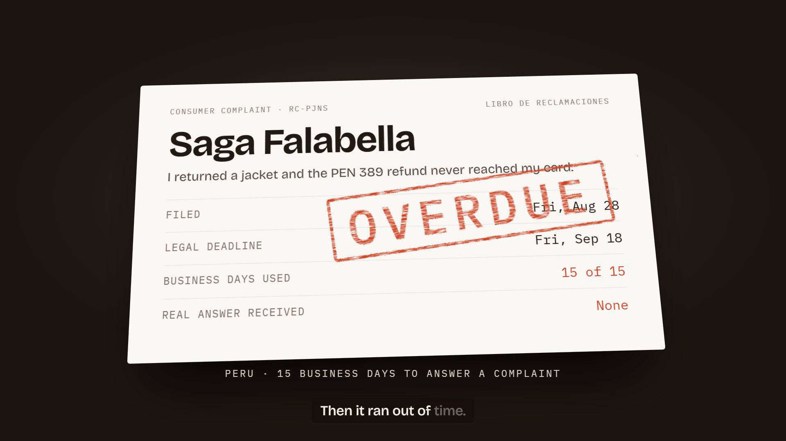

# Duebell

In Peru, a company must answer a formal consumer complaint within **15 business days**, with no extension. Most people never check. Duebell keeps the clock for them.

**Live app:** https://sleek-grouse-640.convex.site
**Demo video (1:36):** https://youtu.be/dViTfHukVrc

[](https://youtu.be/dViTfHukVrc)

The video is a real run in production on Sep 18, 2026. The company reply is a sample text sent through the same webhook handler, and the demo control moves the calendar so the deadline can pass on camera; the deadline check itself runs on its own. The Convex logs shown are from that same run.

## How it works

1. You file your complaint in the company's official complaint book (the *Libro de Reclamaciones*) and give Duebell's inbox as your contact email.
2. **Convex** starts a legal clock that counts Peruvian business days, skipping weekends and national holidays. A scheduled function fires at the end of the deadline day and marks the claim overdue if no real answer arrived.
3. When the company replies, **AgentMail** receives the email through a signed webhook and routes it to the right claim by thread or reference code.
4. **OpenAI** classifies the reply as a real commitment, a resolution, or stalling. It quotes the exact sentence it relied on, and the quote is checked against the original email before it is shown.
5. **Firecrawl** drives Indecopi's public sanctions registry (Indecopi is Peru's consumer protection agency) and brings back the company's sanction record, which OpenAI translates into plain English.
6. If the company stalls or misses the deadline, Duebell drafts the filing for Indecopi in Spanish, with an English version for reference. You review it and submit it yourself.

Everything updates live in the browser through Convex queries.

## Try it in 30 seconds

1. Open the live app. The home page plays a **recorded case**: a 44 second replay of a real run, from filing to the drafted Indecopi filing. No clicks needed.
2. Click **Try it live**, then **Try it with a sample complaint**. The clock starts and Firecrawl begins pulling the company's sanction record.
3. Click **Simulate the company's reply**. A typical non-answer goes through the same handler a real email uses, and OpenAI classifies it within seconds. You can also send a real reply from your own mail client with **Send a real one by email**.
4. Click **Jump past the deadline** to see the scheduled deadline check fire and the filing appear.

## How the AI is kept honest

- OpenAI answers with a strict JSON schema: verdict, confidence, the sentence it relied on, a reason, and what a real answer still lacks.
- The quoted sentence is checked against the original email before it is shown. A quote that does not appear in the reply is discarded (`convex/lib/classification.ts`).
- The model never moves the clock. Deadlines are computed in TypeScript from Lima business days, and a missed deadline stays missed unless the company actually resolves the case.
- Offense names from Indecopi are translated for display only; the Spanish original is kept.

## Limits

- There is no sign-in yet, so every visitor sees every claim. Do not put real personal data in the live demo.
- Peru only. National holidays for 2026 and 2027 are hardcoded (`convex/lib/businessDays.ts`).
- Indecopi's sanctions registry has no API. Firecrawl drives the public site, so a redesign of that site can break the lookup until the parser is updated.
- The recorded case uses a sample company reply and compresses the 15 business days. The sanctions record, the verdict and the quote in it are real output.
- The simulated reply works once per claim. Duebell drafts the Indecopi filing but never submits it for you.

## Beyond Peru

Duebell is built for Peru, and the country-specific parts are kept small. The 15 business day rule and the holiday calendar live in `convex/lib/businessDays.ts`, the public sanctions lookup in `convex/sanctions.ts`, and the filing template in `src/lib/draft.ts`. Supporting another country means supplying its response deadline, its holidays, its public enforcement registry and its filing format; the inbox, the reply classification and the scheduled deadline check stay the same.

## Stack

| Piece | Where |
|---|---|
| Schema, indexes | `convex/schema.ts` |
| Legal clock and state machine | `convex/claims.ts`, `convex/lib/businessDays.ts` |
| Inbound email webhook | `convex/http.ts`, `convex/inbound.ts` |
| Reply classification | `convex/classify.ts`, `convex/lib/classification.ts` |
| Sanctions lookup | `convex/sanctions.ts`, `convex/lib/sanctions.ts` |
| Frontend | `src/`, served by Convex static hosting |

## Run locally

```bash
npm install
npx convex dev
npm run dev
```

Set these on your Convex deployment: `OPENAI_API_KEY`, `FIRECRAWL_API_KEY`, `AGENTMAIL_API_KEY`, `AGENTMAIL_WEBHOOK_SECRET`, `AGENTMAIL_INBOX_ADDRESS`.

```bash
npm test
```

Built for the Convex All Gas Hackathon. Build log: [hackathon.md](./hackathon.md). Design system: [docs/design-system.md](./docs/design-system.md).
